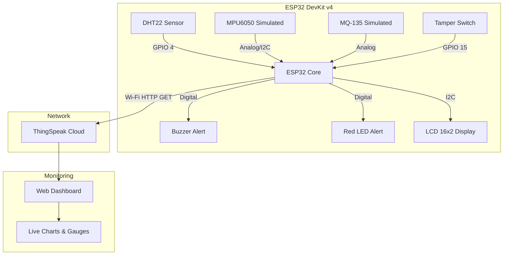

# 🚑 Smart Vaccine Delivery System

[](#)
[](#)
[](#)
[](#)

> **An IoT-based real-time monitoring system ensuring vaccine cold-chain integrity during transport.**

## 📑 Table of Contents
- [🎯 Overview](#-overview)
- [✨ Key Features](#-features)
- [🏗️ System Architecture](#-system-architecture)
- [🧰 Hardware Components](#-hardware-components)
- [🧠 Logic & Damage Scoring](#-damage-scoring-algorithm)
- [📊 Web Dashboard](#-web-dashboard)
- [🚀 How to Run](#-how-to-run)
- [📁 Folder Structure](#-folder-structure)

---

## 🎯 Overview

Vaccines are highly sensitive biological products. A break in the **cold chain** or physical damage during transport can render them ineffective or dangerous. 

The **Smart Vaccine Delivery System** is an IoT simulation (and deployable firmware) that monitors:
- **Temperature & Humidity** to prevent spoilage and condensation.
- **Physical Shocks & Driving Behavior** via acceleration and gyroscope data.
- **Gas/Odor** metrics to detect container leakage.
- **Security** via a tamper-detection switch.

Data is continuously uploaded to **ThingSpeak Cloud** and visualized on a **Real-Time Web Dashboard**.

---

## ✨ Features

- **Multi-Sensor Fusion**: Combines data from DHT22, MPU6050, MQ-135, and tamper switches.
- **Edge Analytics**: Calculates a real-time **Damage Score** on the ESP32.
- **Smart Alerts**: Multi-tier alerts (Normal, Warning, Critical) triggered locally (Buzzer/LED/LCD) and remotely.
- **Cloud Integration**: Regular telemetric uploads to ThingSpeak API.
- **Interactive Dashboard**: Modern web interface featuring live gauges, historical time-series charts, and event simulation presets.

---

## 🏗️ System Architecture



*(Note: The diagram above illustrates the data flow from physical/simulated sensors via the ESP32 to the cloud, and finally to the dashboard).*

---

## 🧰 Hardware Components

| Component | Model | Purpose | Pin(s) Connection |
|-----------|-------|---------|-------------------|
| **Microcontroller** | ESP32 DevKit v4 | Processing + WiFi | — |
| **Temp & Humidity** | DHT22 | Cold-chain monitoring | GPIO 4 |
| **Motion Sensor** | MPU6050* | Shock/Drop/Speed detection | GPIO 35, 32 |
| **Gas Sensor** | MQ-135* | Leakage/Spoilage detection | GPIO 34 |
| **Security** | Push Button | Box-open / Tamper detection| GPIO 15 |
| **Audio Alert** | Piezo Buzzer | Audible warnings | GPIO 13 |
| **Visual Alert** | Red LED | Visual warnings | GPIO 2 |
| **Local Display** | LCD 1602 (I2C) | Local status display | GPIO 21 (SDA), 22 (SCL)|

> \**Simulated using potentiometers in the Wokwi environment. The actual firmware includes the real I2C/analog library dependencies for physical deployment.*

---

## 🚦 Status Codes & Damage Scoring

The system evaluates a composite **Damage Score (0–10)** every 2 seconds. A score $\ge 5$ immediately triggers a **CRITICAL** state.

| Code | Condition Trigger | Meaning | Damage Penalty | Severity |
|:---:|-------------------|---------|:---:|:---:|
| `0` | Temp < 2°C or > 8°C | Cold chain failure | **+3** | 🔴 Critical |
| `1` | All normal | OK | **0** | 🟢 Normal |
| `2` | Switch = LOW | Box Opened (Tamper) | **+2** | 🟡 Warning |
| `3` | Accel > 20,000 | Shock / Drop | **+2** | 🔴 Critical |
| `4` | Gyro > 30,000 | Unsafe Driving | **+1** | 🟡 Warning |
| `5` | Gas > 400 | Leakage / Spoilage | **+3** | 🔴 Critical |
| `6` | Humidity > 80% | Condensation Risk | **+1** | 🟡 Warning |
| `9` | **Score $\ge$ 5** | **CRITICAL OVERRIDE** | — | 🚨 **FATAL** |

---

## 📊 Web Dashboard

A custom-built HTML/JS dashboard (`dashboard/`) provides operators with a full visual command center:
1. **Dynamic Gauges**: Real-time rendering of Temp, Hum, Accel, and Gas values using Canvas API.
2. **Time-Series Chart**: Live histories plotted via Chart.js, supporting multiple datasets.
3. **Event Simulator**: Built-in buttons to trigger edge-case scenarios (Heat, Cold, Drop, Crash, Leak).
4. **Alerts Log**: Timestamped rolling log of state changes and threshold breaches.

---

## 🚀 How to Run

### 1. Wokwi Simulation
The project incorporates a fully configured Wokwi simulation.
1. Open the project in VS Code with the [Wokwi extension](https://marketplace.visualstudio.com/items?itemName=Wokwi.wokwi-vscode) installed, or upload the `wowki/` folder contents to [Wokwi.com](https://wokwi.com/).
2. Run the `sketch.ino`.
3. Interact with the potentiometers to simulate changes in gas, acceleration, and humidity, and use the push button for tamper control.

### 2. Local Dashboard
1. Open the `dashboard/index.html` file in any modern web browser.
2. The dashboard simulates fetching telemetry—use the "Event Simulator" buttons on the UI to test visual responses to sensor fluctuations!

### 3. Physical Hardware Deployment
1. Wire the components to the ESP32 as defined in the **Hardware Components** table.
2. Open `sketch.ino` in the Arduino IDE.
3. Uncomment the `#include <Wire.h>` and `#include <MPU6050.h>` headers.
4. Replace the `apiKey` variable with your **ThingSpeak Write API Key**.
5. Update `ssid` and `password` with your Wi-Fi credentials.
6. Compile and upload to the ESP32.

---

## 📁 Folder Structure

```text
.
├── dashboard/               # Frontend monitoring web application
│   ├── index.html           # Dashboard UI layout
│   ├── script.js            # Dashboard logic, charting, and alert system
│   └── style.css            # Custom dashboard styling
├── docs/                    # Additional documentation and notes
│   └── README.md
├── images/report/           # Presentation materials and system diagrams
├── wowki/                   # Simulation files and ESP32 firmware
│   ├── sketch.ino           # Main C++ source code for the ESP32
│   ├── diagram.json         # Wokwi circuit wiring map
│   ├── libraries.txt        # Required Arduino libraries for Wokwi
│   └── wokwi-project.txt    
├── wokwi.toml               # Wokwi project configuration
└── README.md                # This file
```

---
*Created for CS-744: Internet of Things Course.*
